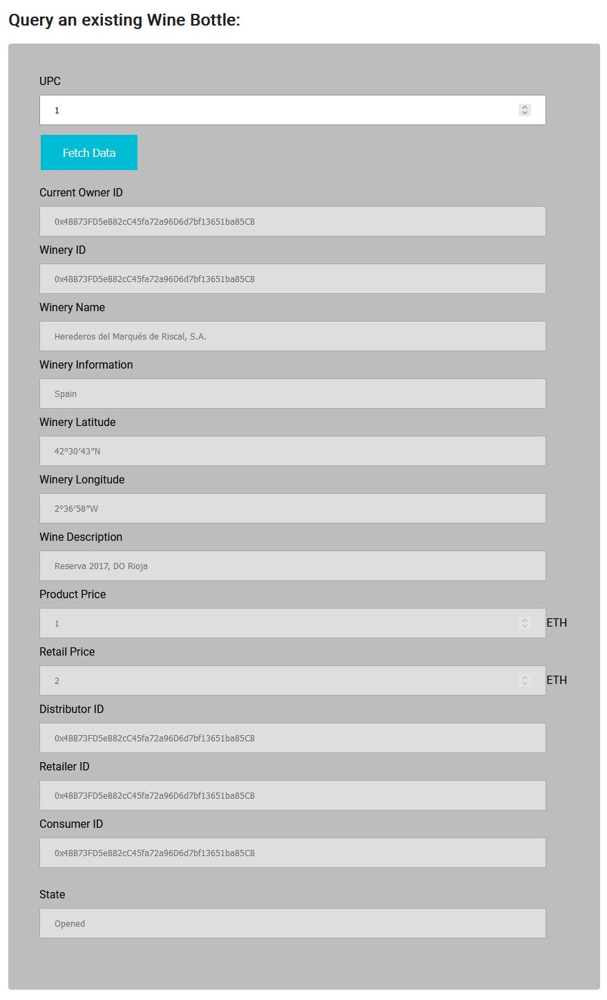

# Wineum: The Ethereum Wine Supply Chain Platform

## Introduction

Wineum is a basic supply chain platform for Wine production & distribution. But it can be extended further to include all possible scenarios in a modular way.

## Project Setup

### Planning

Here are the UML diagrams used for planning the project.

1. Activity Diagram

2. Sequence Diagram

3. State Diagram

4. Class Diagram

### Libraries

I used Truffle smart contract development environment to build this project.

- Truffle v5.6.0 (core: 5.6.0): One of the leading smart contract dev environment
- Ganache v7.4.3: Local testnet for testing
- Solidity - 0.8.17 (solc-js): Latest Solidity compiler
- Node v16.17.0: Node toolchain for truffle framework & frontend dev
- Web3.js v1.7.4: Web3 library to interact with deployed smart contracts
- dotenv: to manage the visibility of wallet private key & infura key
- @truffle/hdwallet-provider: To access my wallet for smart contract deployment

I plan to extend this project later using IPFS to upload product images by the producer (pending)

## Testing

10 basic test cases in the "test" directory.
All pass.

## Deployed on Goerli Testnet

Smart contracts deployed at:

- WineryRole: 0x052Ad2240AF0100A42817ad622F4115343144332
- DistributorRole: 0xC2053b131B4BC6730AAfB8970a3c85060A32e533
- RetailerRole: 0xfeaACf8F742899b6A6213974c220094cE2913031
- ConsumerRole: 0x191fFBdf00857CE82a1D7633915f695715A766f0
- SupplyChain: 0xDa0ab7d6Af124dAdB0a1092a7Ed58B972a1fDEd6

## Frontend Code

I've included sample frontend code to interact with the smart contracts in a local testnet (ganache).

Screenshots:

